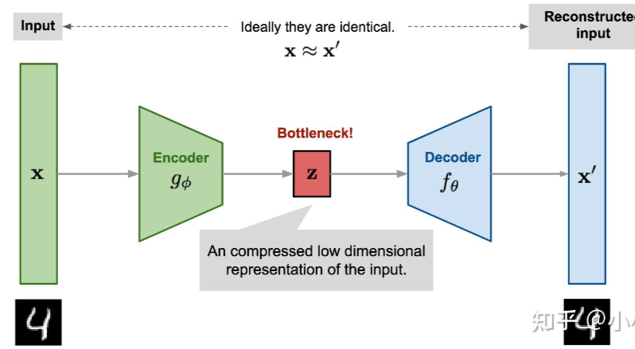
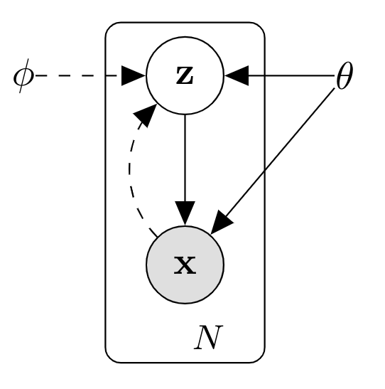

1. 最大化似然模型
2. 自动编码器 autoencoder：先将高维的原始数据映射到一个低维特征空间，然后从低维特征学习重建原始的数据。包含两部分：

    - encoder：将原始的高维数据映射到低维特征空间，这个特征维度一般比原始数据维度要小，这样就起到压缩或者降维的目的，这个低维特征也往往成为中间隐含特征
    - decoder：基于压缩后的低维特征来重建原始数据

    

    $g_\phi$为encoder网络的映射函数， $f_\theta$为decoder网络的映射函数， 从而有 $x'=f_\theta(z)=f_\theta(g_\phi(x))$ ， $x'$ 即为重建的数据。我们的目标是希望重建的数据和原来的数据近似一致，那么AE的训练损失函数可以采用简单的MSE(均方误差)：

    $$L_{AE}(\theta,\phi)=\frac{1}{n}\sum_{i=1}^{n}(x^{(i)}-f_\theta(g_\phi(x^{(i)})))^2$$

    AE不需要对数据进行标注 => AE无监督，由于压缩后的特征能对原始数据进行重建，所以我们可以用AE的encoder对高维数据进行压缩，这和PCA非常类似，当然得到的隐含特征也可以用来做一些其它工作，比如相似性搜索等。

    变种：DAE，去噪自编码器。在训练过程中先对输入$x$进行一定的扰动。相比AE，DAE重建难度增加

3. 变分自动编码器 ==> variational autoencoder

    结构与AE类似，建模方面存在较大区别。本质上VAE是一种基于[变分推断](https://zhuanlan.zhihu.com/p/118377754)的概率模型，属于生成模型，无监督模型。在变分推断中，除了已知的数据（观测数据，训练数据）外还存在一个隐含变量，这里已知的数据集记为 $X=\{x^{(i)}\}_{i=1}^{N}$ 由 $N$ 个连续或者离散变量 $x$ 组成，而未观测的随机变量记为 $z$ ，那么数据的产生包含两个过程:

    1. 从一个先验分布 $p_\theta(z)$ 中采样一个 $z^{(i)}$
    2. 根据条件分布 $p_\theta(x|z)$ ，用 $z^{(i)}$ 生成 $x^{(i)}$ 

    $\theta$ 指的是分布的参数。我们希望找到一个参数 
     $\theta^{*}$ 来最大化生成真实数据的概率

    $$\theta^{*}=\mathop{argmax}\limits_{\theta}(\prod_{i=1}^{n}p_{\theta}(x^{(i)}))\\p_{\theta}(x^{(i)})=\int{p_{\theta}(x^{(i)}|z)p_{\theta}(z)dz}$$

    上述积分计算不现实：先验分布$p_{\theta}(z)$未知；如果分布复杂，对z穷举计算太耗时间。变分推断引入后验分布$p_\theta(z|x)$来联合建模，根据贝叶斯公式，后验分布为：

    $$p_\theta(z|x)=\frac{p_\theta(x|z)p_\theta(z)}{p_\theta(x)}$$

    

    实线代表我们想要得到的生成模型 $p_{\theta}(x|z)p_{\theta}(z)$ ，其中先验分布 $p_{\theta}(z)$ 往往事先定义，而 $p_{\theta}(x|z)$ 用一个网络学习

    把$z$看成隐含特征，那么这个网络可以看成一个**probabilistic decoder**(?)。虚线代表的是对后验分布 $p_{\theta}(z|x)$ 的变分估计，记为 $q_{\phi}(z|x)$ ，它也可以用一个网络来学习，这个网络可以看成一个**probabilistic encoder**(?)

4. GAN是通过对抗训练实现的一种隐式生成模型